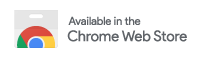
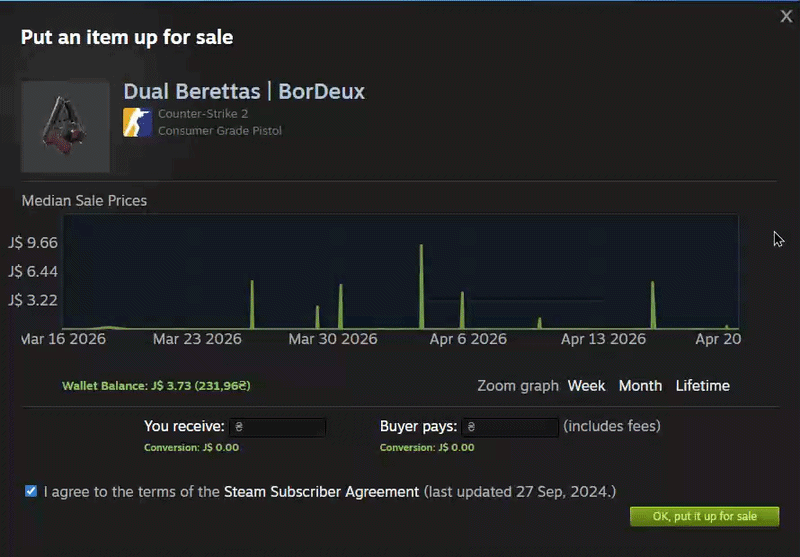
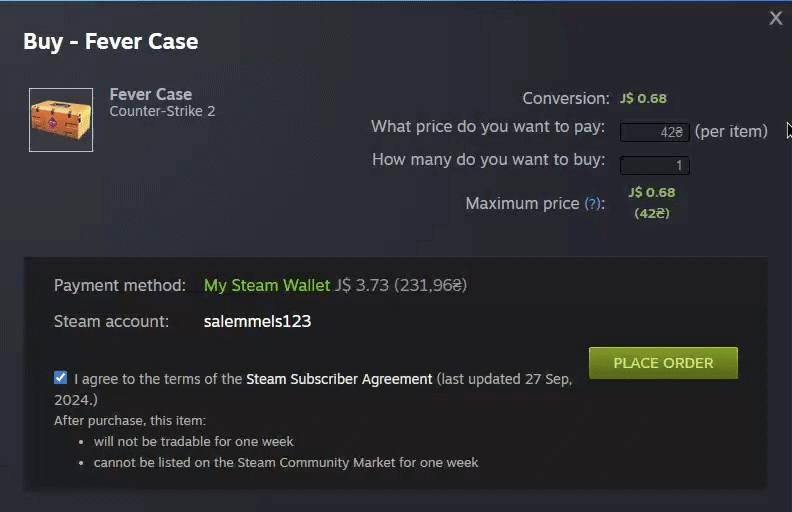
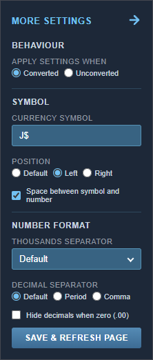

# Steam Currency Converter

A browser extension that converts Steam prices to your preferred currency as you browse. Works across the store, community market, and checkout.

## Overview

Real-time currency conversion built directly into Steam. No tab switching, no interruptions. Supporting **164 currencies**, it works across the store, community market, and checkout, keeping prices in your currency as you browse. On top of conversion, it comes with a set of quality-of-life features like hover to compare, full market dialog support, and deep formatting controls to make the numbers feel familiar.

## What it does

You pick a source currency (what your Steam wallet uses) and a target currency (what you want to see). The extension then rewrites every price on the page to your target, live, without a refresh. Dynamically loaded content like search results, bundle items, and market listings get converted too.

On the Community Market it goes further: wallet balance, the buy/sell dialogs, and the price history graph tooltips all update to your chosen currency.

Exchange rates come from [exchangerate-api.com](https://exchangerate-api.com), fetched once per day and cached locally. If the API is unreachable, it falls back to whatever was last cached.

## Getting Started

1. Install the extension
2. Open the popup by clicking the extension icon
3. Set **Store currency** (the currency your Steam store charges you in)
4. Set **Convert to** (the currency you want to see)
5. Click **Save & Refresh**

Prices on Steam will now show in your chosen currency. That's it.

## Installation

### Browser

**Chrome:** Install from the [Chrome Web Store](https://chromewebstore.google.com/detail/steam-currency-converter/kkpmhkmhbcdkagimlpcofbffhmdppmmb), or load manually:
1. Go to `chrome://extensions` and enable Developer Mode
2. Click **Load unpacked** and point it at the extension folder

**Firefox:** Install from [Firefox Add-ons](https://addons.mozilla.org/en-US/firefox/addon/steam-currency-converter/) and grant permissions from the Manage Extensions tab, or load manually:
1. Go to `about:debugging` and click **This Firefox**
2. Click **Load Temporary Add-on** and select `manifest.json`

### Steam Client

You can run this extension directly inside the Steam desktop client using two community tools:

1. Install **[Millennium](https://github.com/SteamClientHomebrew/Millennium)**, a plugin loader for the Steam client
2. Install the **[Extendium](https://github.com/BossSloth/Extendium)** plugin via Millennium, which adds Chrome extension support to Steam
3. Load this extension through Extendium like you would on chrome

> **Disclaimer:** This is not officially supported by Valve and may violate their terms of service. Proceed at your own responsibility.

## What's included

### Hover to Compare

Every converted price is interactive. Hovering over it temporarily swaps back to the original Steam price so you can cross-reference without toggling anything.

If you want this off, there's a checkbox in the popup to turn it off entirely. Conversions stay visible without the hover behavior.

### Community Market Support

When you open a buy or sell dialog on the Steam Community Market, the extension injects a live converted price preview showing what you receive, what the buyer pays, and the order total. These update as you type so you always know the real amount in your currency before confirming. The price history graph on the sell dialog is converted too.

### Custom Number Formatting & Symbols

Each currency ships with sensible locale defaults like German-style `2,64 €` or Vietnamese `312.000₫`. You can override any of it: set your own thousands and decimal separators, strip `.00` from round numbers, or replace the symbol entirely with any text you want. Symbol position (left or right) and spacing are configurable too.

If your Steam store shows prices with a trailing `USD` suffix (e.g. `$9.99 USD`), there's a checkbox to strip it. Useful even if you're not converting, just to keep prices cleaner.

## Configuration

The popup has two layers of settings.

**Basic:**
- Source and target currency
- Toggle conversion on/off
- Hover to reveal the original price
- Strip trailing `USD` from prices that show it redundantly

**Formatting (under "More settings"):**
- Custom symbol text, position (left/right), and spacing
- Override thousands and decimal separators independently
- Hide `.00` on round numbers
- Apply formatting to converted prices only, or unconverted prices too

## Technical notes

- Manifest V3, Chrome and Firefox
- Prices are detected with per-currency regex that handles symbol position, regional separators, non-breaking spaces, and alternate symbol forms (e.g. PHP shows `₱` in search but `P` on game pages)
- Converted nodes are stamped with `data-cc-rate` so the MutationObserver skips them on re-runs without any comparison logic
- Hover targets and their associated text nodes are cached in a WeakMap to avoid re-walking the DOM on every mouse event
- The background service worker retries failed rate fetches once and keeps itself alive across browser sessions

## Disclaimer

This extension is meant to give you a general idea of prices, not financial advice. Rates are updated daily but accuracy isn't guaranteed. Some currencies are spot on while others can be a bit off, and prices shown may not always be current or error-free. Double-check before making any purchase where it matters. I'm not responsible for any loss or inconvenience caused by using this extension. By using it, you agree that any consequences are your own responsibility.

## Issues

Something broken or a currency behaving oddly? [Open an issue](https://github.com/brullee/steam-currency-converter/issues/new).

## License

Open source under the [MIT License](LICENSE).
